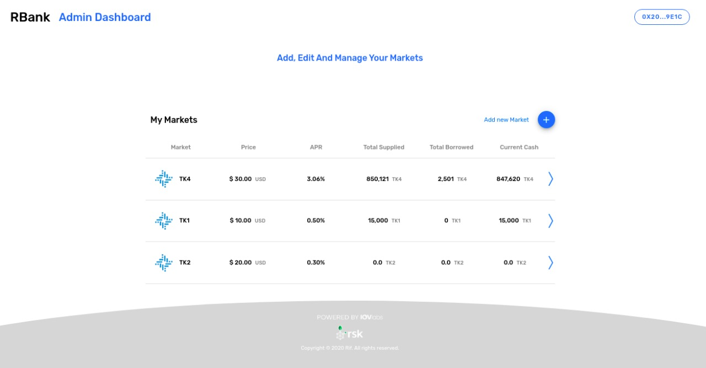
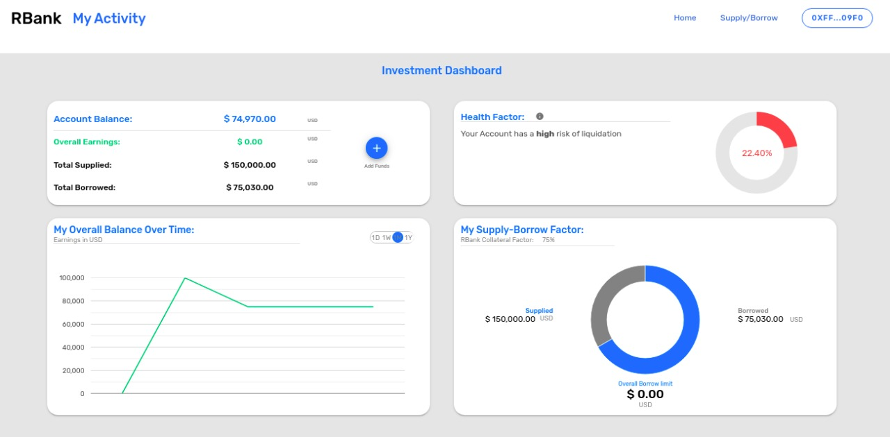
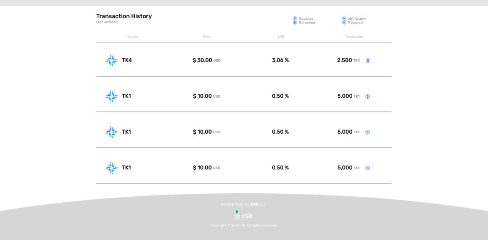
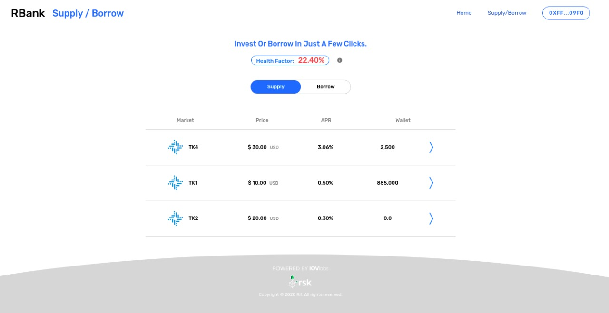

# RBank demo ÐApp
This is a demo on how to integrate [RBank library][1] into a Vue.js project.

|  |  |
| --- | --- |
|  |  |

## Requirements
 * Docker ^19.0.3
 * Docker compose ^1.25.4
 * Deploy a [RBank controller][2]

## Usage
In `docker-compose.yml` modify `RBANK_CONTROLLER` with the address of your RBank controller contract.

Then run the docker container.
```bash
docker-compose up
```

Then access the ÐApp in your browser at the given url (<https://localhost> by default)

[1]: https://www.npmjs.com/package/@rsksmart/rbank
[2]: https://github.com/rsksmart/DeFiProt
